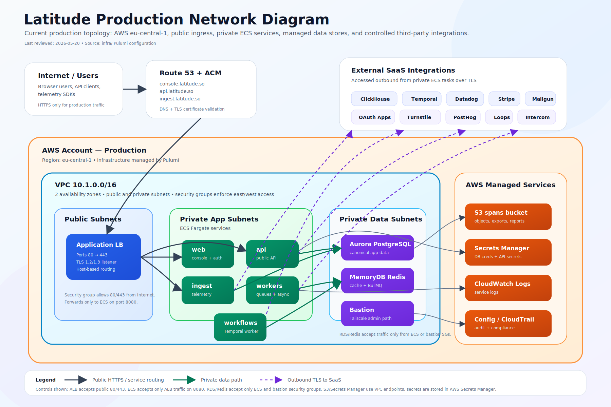

# Network Diagram

Latitude production runs in AWS `eu-central-1` with public HTTPS ingress, private ECS application services, private managed data stores, AWS managed support services, and outbound TLS integrations to approved SaaS providers.

## Diagram source

- Rendered diagram: [`./assets/latitude-network-diagram.svg`](./assets/latitude-network-diagram.svg)
- Infrastructure source of truth: `infra/` Pulumi configuration
- Last reviewed: 2026-05-20

## Production topology summary

- Public users and API clients reach Latitude through Route 53 DNS records and ACM-managed TLS certificates.
- The public Application Load Balancer lives in public subnets and accepts only HTTP/HTTPS from the internet. HTTP redirects to HTTPS when a certificate is configured.
- The ALB forwards host-based traffic to private ECS Fargate services on port `8080`:
  - `web` for the authenticated console and auth routes
  - `api` for the public API
  - `ingest` for telemetry ingestion
  - `workers` for asynchronous worker processes and Bull Board routing
  - `workflows` for the Temporal worker process
- ECS tasks run in private subnets and use the ECS task security group.
- Aurora PostgreSQL and Redis/MemoryDB run in private data subnets and accept traffic only from the ECS and bastion security groups.
- The bastion host is the controlled administrative network path for private infrastructure troubleshooting and is described as Tailscale VPN-backed in the security group configuration.
- S3 and Secrets Manager are AWS managed services reached through configured VPC endpoints where applicable.
- Application secrets, database credentials, OAuth secrets, Stripe secrets, Temporal credentials, Datadog credentials, and other provider keys are stored in AWS Secrets Manager.
- Application logs are written to CloudWatch log groups and exported/observed through Datadog sidecars and Datadog SaaS.
- Outbound third-party integrations use TLS to approved SaaS services such as ClickHouse Cloud, Temporal Cloud, Datadog, Stripe, Mailgun, OAuth providers, Cloudflare Turnstile, PostHog, Loops, Intercom, and Voyage AI.

## Security boundaries represented

- **Internet boundary:** only the ALB is public-facing.
- **Public subnet boundary:** public subnets host the ALB; application compute does not run there.
- **Private app subnet boundary:** ECS services receive inbound traffic only from the ALB security group on port `8080`.
- **Private data subnet boundary:** RDS and Redis receive inbound traffic only from ECS and bastion security groups on their database/cache ports.
- **Secrets boundary:** runtime secrets are retrieved from AWS Secrets Manager; secret values are not stored in code.
- **Tenant data boundary:** product data access is enforced by application-level organization context, Postgres RLS conventions, API-key organization scoping, and organization-first query patterns for telemetry analytics.
